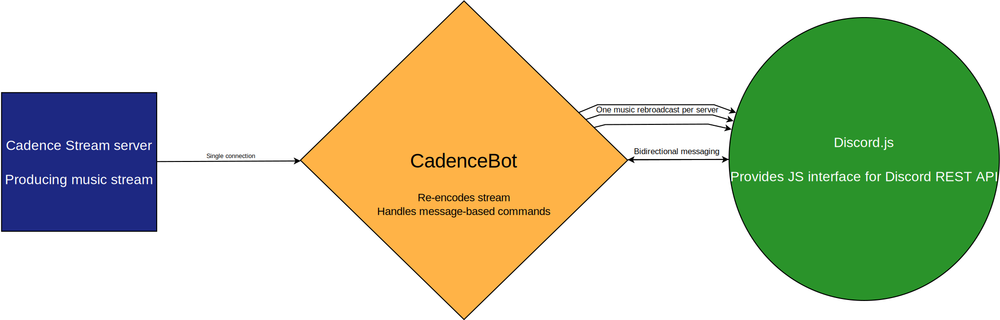
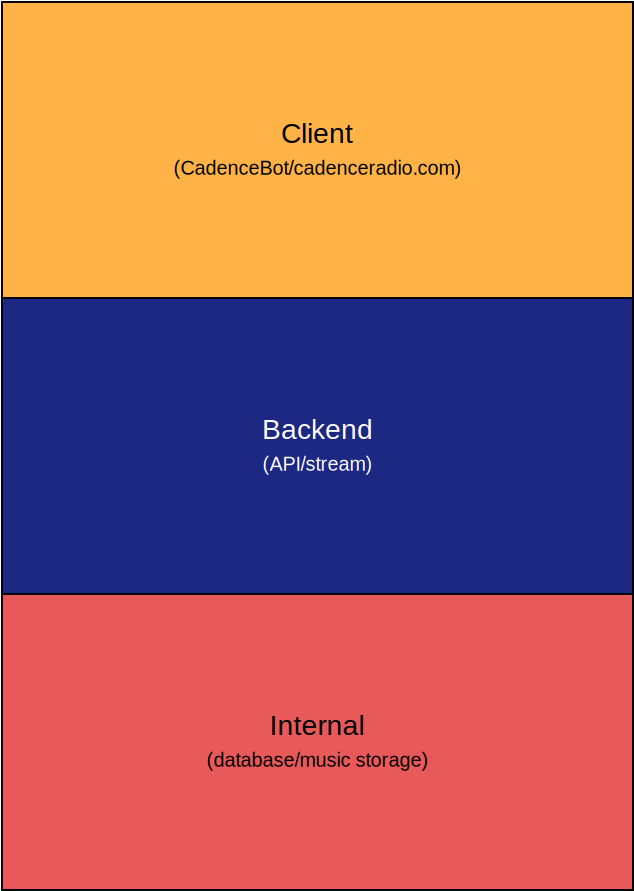

# CadenceBot

**CadenceBot** is a [Discord](https://discordapp.com/) bot client for a [Cadence Radio](https://github.com/kenellorando/cadence) stack. 

It allows you to control your station through a Discord server and listen to the radio in voice channels! 

You can demo CadenceBot immediately by [adding it to your Discord server](https://discord.com/api/oauth2/authorize?client_id=372999377569972224&permissions=274881252352&scope=bot).

## Quick Setup

### Requirements
1. You have familiarity self-hosting on a Linux server and using the `apt` package manager.

### Installation
1. [Get your token from Discord](https://github.com/reactiflux/discord-irc/wiki/Creating-a-discord-bot-&-getting-a-token) and save it somewhere.
2. Run the script `first-time-setup.sh`. This will prompt you for an (optional) email to deliver bot logs to and the Discord token you saved in the previous step.
3. Run `restart.sh` or `node bot.js` and your instance of CadenceBot will start running.

If at any point you need to recreate this setup to change configured parameters, you may simply rerun `first-time-setup.sh`.

- See all alternative installation methods on [Installation Guide].

## Implementation Details

For more details of the Cadence ecosystem as a whole, see the main README on the [main Cadence repository](https://github.com/kenellorando/cadence). The following diagrams and description will center around CadenceBot itself.

Music and interaction with Discord

Put simply, CadenceBot will connect once to the stream server (globally for the entire instance), to reduce load on the backend layer - This will also keep all Discord servers listening to the same bot in sync, but it means a stream downlink failure will affect the entire bot, and it means that any future work on the bot will not include allowing one bot to service multiple music streams (in other words, to connect to more than one Cadence stream, one must deploy as many bot instances).

Separately, CadenceBot subscribes to Discord to receive messages invoking commands, and therefore also sends messages back to Discord as part of user interaction.

The Cadence Stack

CadenceBot is a client in the Cadence stack - Specifically, it is the Discord client (as opposed to the "main" web client, or any other alternative clients that may be created. The client layer is the top, user-facing layer, which provides Cadence services in a way that unknowledgable users can understand, receive, and interact with. The goal is for all clients to provide a cohesive experience - Each client should have the same core feature set, and the implementations of each should behave as similarly to one another as possible, to whatever extent these goals are reasonable within the platforms they serve (that is to say, it is not reasonable for a Discord client to provide its own volume slider, as Discord naturally provides its own, or for a web client to provide a "conversational" interface as one can for a text-based Discord client).

Beneath the client layer is the backend layer, with which the clients interact, and which provides them with sources of data (song metadata, availability), with the Cadence broadcast, and with behavior interfaces. Beneath the backend layer sits the internal layer, which provides the actual data sources the backend services consume.

Dataflow within the Cadence ecosystem

At a high level, the services provided by Cadence can be split into four functional parts - Referring to the stack presented above, the client and internal layers both act as a monolith, as far as the outside world is concerned - Though their implementation may be more or less monolithic as is useful to maintainers of those layers.

However, the backend layer is split into two functional components - The REST API, which provides metadata and control of the music stream, and the stream server, which generates and broadcasts the music stream from the library.

CadenceBot Configuration Loading

CadenceBot is shipped by a working, complete configuration file by default. This file (`default-config.json`) includes a minimal set of configuration that will connect to the main production Cadence deployment. It will include some demonstration as well of available configuration options, as an example of how to write an override configuration file.

The override configuration file (`config.json`) is optional, and will not cause issues if it does not exist or fails to load. If it does load, any options set from it will override options set in the default configuration, while any unset options will fall back to defaults.

Finally, the ban list (`bans.json`) is created and administrated by the bot itself, and will preserve the list of banned users (along with information on when temporary bans are applicable) in case of bot restart. Since bans can be applied by the instance administrator dynamically from Discord, this list must be under the bot's control - It can be alterned manually only while the bot is offline, as changes will not be detected and the file may be reloaded at any time while the bot is active.

## Development

  
Prettier

  
[Prettier](https://prettier.io/) will be used to maintain the formatting of code files in CadenceBot - These being shell scripts (\*.sh) and Node files (\*.js). Configuration files (\*.json) are not affected by this at the moment.

While it is not necessarily required to use Prettier during development, formatting will be performed before new releases are tagged to help maintain some style consistency in the project (via `tag-release.sh`)
  

  
Branches

  
Branch names should avoid uppercase characters where reasonable.

- `dev-master`: Features which are in development or in testing, but will eventually make it to `master`, unless there's some catastrophe in their implementation (such as if they become impractical to translate into production, or if the performance impact of a feature becomes too great)
- `master`: The current production state of CadenceBot. The tip of the master branch shall always be in a state which is functional, and which is able to be used on a server which serves actual users (given proper setup). When this is not the case, it is the highest priority to repair the commit such that this is the case.
- feature branches: Any other branches, which should be named according to the feature or bug they're for (the canonical example is the now-deleted `one-step-request` branch, the feature branch for one-step request) - If this name is too long, it is permissible to create an issue on [the main GitHub repository](https://github.com/za419/CadenceBot/issues/), and name the branch after it (as in `issue-23`).
  - Development on this feature should proceed on this branch, and only on this branch.
    - If this is not a reasonable requirement, it is permissible to make a 'subfeature branch': A branch named with the name of the feature branch (in whole or as an acronym) as a prefix, with a descriptive name for the component the branch is for - Examples would include `one-step-request-filters`, `osr-logging`, or `issue-11-infrastructure`.
    - Again, development of this component should be on this branch, and only on this branch. Sub-subfeature branches, while permissible, are not required: Components of this component, should they require separate branches, may be subfeature branches of the original branch
    - Subfeature branches should be merged into their feature branches as soon as their component is complete. It is permissible for them to live on after their feature branch is merged onto `dev-master`: Then, they shall be merged back into `dev-master` as soon as their component is complete.
  - These branches should be merged into `dev-master` as soon as they are in an 'operational' state
    - That is, as soon as the feature can be activated and can run on the development server (it might not work, or it might occasionally crash the bot, but it does not always crash, even when the feature is triggered), and when the feature is set to go into production (when it is deemed likely to be practical and likely to be a wanted addition to the bot).
    - The feature branch should then be deleted.
  

  
Release Procedure

  
A new release is made whenever `dev-master` is merged into `master`, which is to say whenever a feature is moved from "development" or "testing" to "production". Releases should follow [Semantic versioning](https://semver.org/) (with the difference that, occasionally, I refer to releases which increment patch version as 'minor releases', those which increment minor version as 'releases' and those which increment major version as 'major releases'). Since CadenceBot does not deliver much of an API (it can be used as one, interacting with `command` by mocked messages as is done somewhat often in the bot itself, but this is not the intended use of the bot, and the specifics of what fields the mocked message must define are undocumented, must be found by inspecting the code, and are under no obligation not to change at any time), CadenceBot follows different rules for when version numbers are incremented - Semver compliance is mostly for rigidly formatted versioning which can be automatically parsed.

Version numbers are incremented as follows:

- Major numbers are incremented when the bot appears widely different - A layperson should be able to distinguish CadenceBot v1.x and CadenceBot v2.x as different programs at a glance.
  - I may break this rule later, at my own discretion, if minor numbers become unreasonably large.
- Minor numbers are incremented for significant features - Features on the scale of adding a new command.
  - Examples are [v1.1](https://github.com/za419/CadenceBot/releases/tag/v1.1) (adding `search`), [v1.3.0](https://github.com/za419/CadenceBot/releases/tag/v1.3.0) (adding multi-server support), and [v1.4.0](https://github.com/za419/CadenceBot/releases/tag/v1.4.0) (adding one-step request)
- Patch numbers are incremented for smaller features - Those on the scale of extending an existing command in a way that makes new usage entirely backwards compatible with old usage
  - Examples are [v1.3.1](https://github.com/za419/CadenceBot/releases/tag/v1.3.1) (a bugfix for a bug which made the bot unusable), or [v1.4.1](https://github.com/za419/CadenceBot/releases/tag/v1.4.1) (adding the nowplaying status)
- Beyond-patch numbers are incremented for small bugfixes which amount to quality-of-life fixes - An example might be fixing the format `search` provides results in, or [v1.5.2.1](https://github.com/za419/CadenceBot/releases/tag/v1.4.1) (adding Prettier formatting)

The version number in `package.json` should be incremented when a feature is ready for release. The number should be incremented in compliance with the above guidelines. This change should occur in its own commit, which should be created after everything else is ready for the release (including Prettier formatting and package updates), and which should have no other changes. This commit should have a Sign-off (Signed-off-by), and should be signed with a GPG key if possible.

The commit in which `package.json` it updated is considered to be the one assigned to that version number. Therefore, that commit should be tagged in `git` with the version number (as in `v1.4.1`). This tag should be an annotated tag, with full patch notes, and signed with a GPG key if possible. This tag should then be made a release on GitHub, with the same (or equivalent) patch notes.

To facilitate this release process, this repository includes `tag-release.sh`, which should be used to prepare the repository for a release of any sort. To use it, ensure that all changes destined for the release have been committed, and that no uncommitted changes are present in the repository. Choose a version number for the release (for example, 1.6.0), then run `tag-release.sh 1.6.0`. The script will automatically:

 - Apply and commit any required Prettier reformatting
 - Insert the new version number into `package.json`
 - Create a signed and signed-off commit for the version number update.
 - Create a signed and signed-off tag for the version number update.
   - The script will allow `git` to open your preferred editor to add release notes for the tag.
 - Prompt you to review the changes before pushing them to `master`.

Note that the script does not apply any sort of validation or sanity check to the passed version number at this time: It is up to you, as maintainer, to validate that the version number is correctly formatted, is newer than existing version numbers, and has proper scope.

